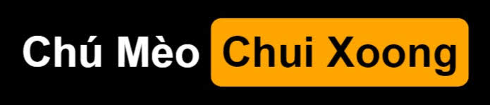

# CPP (Competitive Programming Practice)

CPP Algorithms by [@trhgquan](https://github.com/trhgquan) _aka Chú Mèo Chui Xoong_

Website: [www.tranhoangquan.codes](https://www.tranhoangquan.codes)

Email: contacts@tranhoangquan.codes

## Notes
**Caution:**
_This can makes you losing faith in clean-coding, sometimes can cause social anxiety by watching these spaghettis for hours. Viewer discretion is advised._

\#1: **Spaghetti codes ahead**. These codes are for Judging System, not for Hooman Judging System. I added some comments, for debugging mostly, and I cannot guarantee that you understood it.

\#2: These algorithms __can__ output errors since sometimes problem's testcases are weak. [Feel free to report it here](https://github.com/trhgquan/CPP/issues)

\#3: If you are looking for documents (problem PDFs, problem solving in a nutshell, ..) please contact me: __*my email, in the first section.*__

\#4: Some problems come as .ZIP file, which contains problem's statements and sample source code in C/C++ and Pascal.

## LICENSE
__trhgquan/CPP__ is licensed under the GNU General Public License v3.0.
[Find out more](https://github.com/trhgquan/CPP/blob/master/LICENSE)

If you have a test tomorrow about algorithms, good luck. Keep calm, chill (_not chilling_) and beat it!

From [@trhgquan](https://github.com/trhgquan), with <3 and keyboard.
